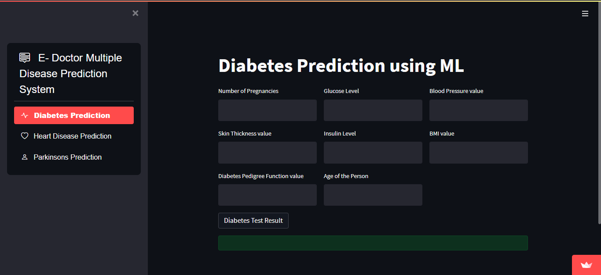
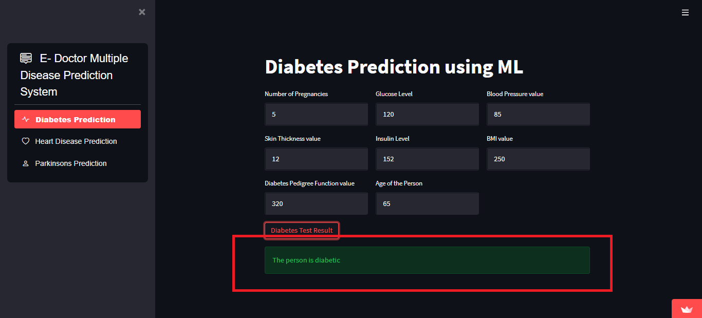
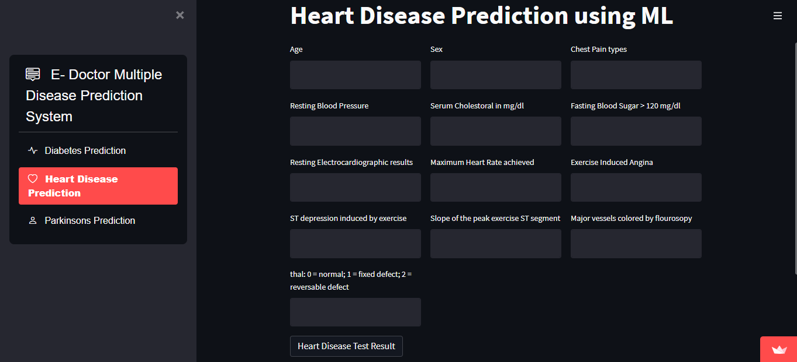
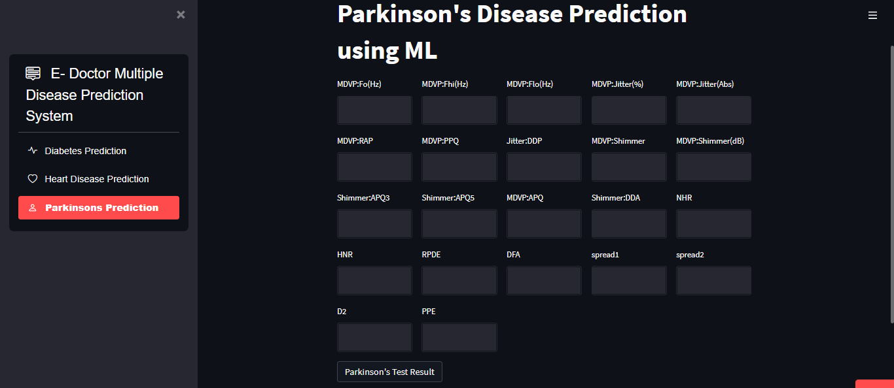

# E-Doctor  (Multiple Disease Predictor)
A web-based disease prediction system is shown in the code above. I trained ML models for three diseases: Diabetes, Heart disease, and Parkinson's disease. Kaggle dataset is used to train the model using the SVM algorithm. To create the graphical user interface, I used the Streamit library and hosted it over the Streamlit cloud service. There are three disease prediction options on the home page, each for a different disease. Using different parameters, the user can choose anyone and our system predicts whether he/she has that disease or not.

## Snapshots of WebApp

#### Happy contributing  👋